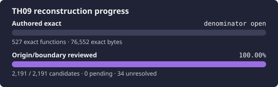

# 東方花映塚 ～ Phantasmagoria of Flower View

<p align="center">
  
</p>

This project reconstructs the original Japanese TH09 version 1.50a
executable. It starts from an independently versioned, hash-attested target and
tracks boundary, origin, source presence, codegen exactness, native-product
closure, runtime semantics, and portability as separate facts.

## Exact target

Supply your own legal copy through `TH09_TARGET_PATH`, an explicit argument, or
the ignored path `resources/th09.exe`:

| Property | Required value |
| --- | --- |
| Version | original Japanese 1.50a |
| Size | `685,056` bytes |
| SHA-256 | `10350095bcf95edb59e03bee9849a2dc8a7714b4927ad5909c569c550fce6822` |
| MD5 | `cf634df46e05552e104fa97a971aaac0` |
| Image base | `0x00400000` |
| Entry point | `0x0047D45F` |

The pinned [thcrap version database](https://github.com/thpatch/thcrap-tsa/blob/f08b582ce57bce800955dd371fc9a68dbad5b324/base_tsa/versions.js)
classifies this exact SHA-256 and size as `th09`, `v1.50a`, `(original)` and
lists the English-patched executable under a different digest. The
[official 1.50a release post](https://kourindou.exblog.jp/1327589/) is dated
2005-10-08 JST, consistent with the target's PE timestamp.

```bash
export TH09_TARGET_PATH='/path/to/legal/th09.exe'
python3 scripts/verify-target.py
python3 scripts/check-ida-mcp.py
python3 scripts/validate-tracking.py --require-target
python3 scripts/report-reconstruction-status.py
```

Original executables, game data, IDA databases, decompiler output, and
downloaded tools are private and never committed.

## Current status

The target and live IDA database are attested. All 2,191 tracked candidates have
received boundary/origin review: 979 are confirmed authored, 1,177 are
classified exclusions, and 35 remain deliberately origin-unknown after review.
Maintained source covers 904 authored mappings, of which 745 are canonical
zero-difference VC7.1 matches.

The PE and Rich header identify Microsoft Visual C++ .NET 2003 build 3077.
Some runtime-library contributions and compiler-generated helpers are proven,
but the complete translation-unit graph, resources, data owners, compiler
profiles, and link order remain open. `config/build.toml` records that state
instead of pretending the project is buildable.

Run `python3 scripts/progress.py` to regenerate the status card and
`python3 scripts/ci.py` for the small target-independent validation set.

## Required phase order

1. Preserve the reviewed boundary/origin inventory and recover remaining exact
   VC7.1 authored units.
2. Close and exercise the faithful Windows i386 product, including static data
   ownership, initializers, resources, libraries, and runtime scenarios.
3. Perform semantic reconstruction with two independent runtime Oracles: the
   original target and the reconstructed native i386 product.
4. Start a portability branch only after the native semantic baseline is
   trustworthy.

Exact functions do not imply a complete or runnable product. A modern port can
hide missing original data owners, ABI behavior, and initialization, so it is
not an acceptable shortcut around the native-product stage.

## Project map

- [`AGENTS.md`](AGENTS.md) — mandatory session, evidence, and checkpoint rules.
- [`config/target.toml`](config/target.toml) — exact target and observed PE/toolchain facts.
- [`config/build.toml`](config/build.toml) — whole-product graph and explicit unknowns.
- [`docs/RE_WORKFLOW.md`](docs/RE_WORKFLOW.md) — bounded reconstruction loop and stage gates.
- [`docs/ORACLES.md`](docs/ORACLES.md) — what can falsify or accept each claim.
- [`docs/RE_HANDOFF.md`](docs/RE_HANDOFF.md) — current phase and restart commands.
- [`docs/KNOWLEDGE_BASE.md`](docs/KNOWLEDGE_BASE.md) — durable TH09-only facts.
- [`docs/TOOLS.md`](docs/TOOLS.md) — local and Factory tool routing.
- [`docs/PROGRESS.md`](docs/PROGRESS.md) — generated ledger totals.
- [Touhou Reconstruction Factory](https://github.com/N0zoM1z0/touhou-reconstruction-factory) — shared ontology, workflow, and cross-game knowledge.

## License

Repository-authored code and documentation are provided under the MIT License.
This does not grant rights to the original game or its assets.
